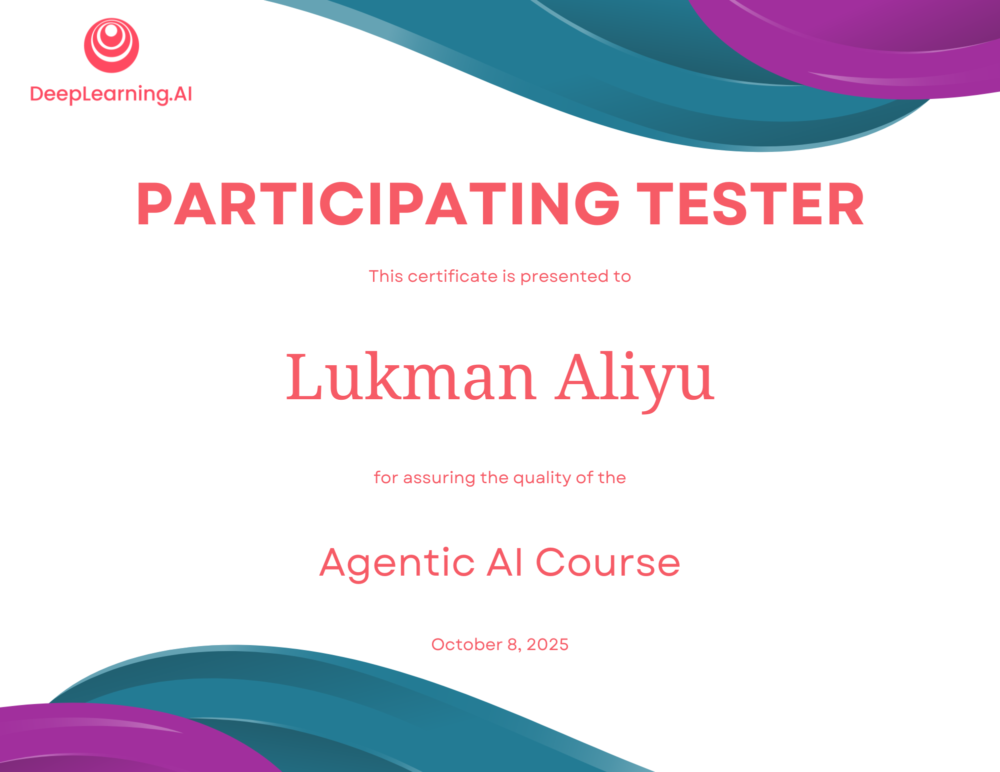

I am super excited to share another milestone that reflects my commitment to giving back to the AI learning community. 

In late September 2025, I had the unique privilege of serving as one of course **testers** in the [DeepLearning.AI](https://www.deeplearning.ai) Discourse forums, that supported the rigorous testing of the Andrew Ng's latest course titled `Agentic AI Course`. 

We had to look at the course holistically and check if it covers the four design patterns that power agentic AI systems (according to the `DeepLearning.AI` course page):

- Reflection: AI critiques its own work and iterates to improve quality—like code review, but automated.
- Tool Use: Connect AI to databases, APIs, and external services so it can actually perform actions, not just generate text.
- Planning: Break complex tasks into executable steps that AI can follow and adapt when things don’t go as expected.
- Multi-Agent: Coordinate multiple specialized AI systems to handle different parts of a complex workflow.

I critically examined the video lessons, the graded and ungraded lab jupyter notebooks as well as the graded quizzes. I had a good time learning so many new agentic AI concepts. 

I am someone who has benefited greatly from learning communities, and I am super happy to give back in any little way I can. Agentic AI is the current trend and it was exciting to learn that Andrew came up with the name Agentic as used today in so many AI related workflow. 

Below is the certificate:

I'm deeply thankful to the DeepLearning.AI team for creating such a thriving and inclusive space for learners, testers,mentors and other vibrant members of the AI community.

Stay curious, stay generous. 

---

_If you’re learning or participate in testing AI courses, feel free to reach out or share your experience—I’d love to hear your story!_

