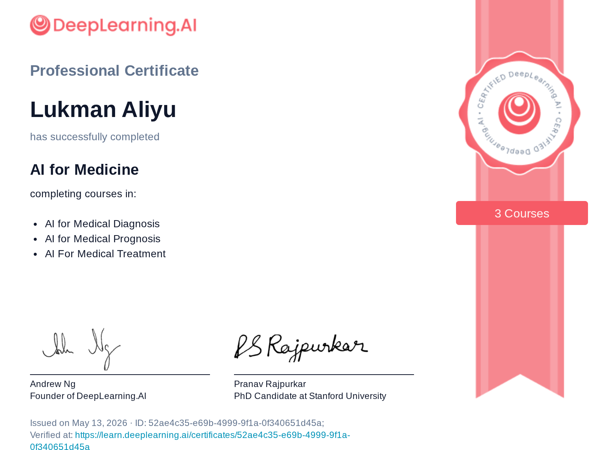

I just completed the [AI for Medicine Specialization](https://learn.deeplearning.ai/specializations/ai-for-medicine/) for the second time, having first finished it about two years ago. DeepLearning.AI recently launched their own learning platform, and a majority of courses were migrated there from Coursera, though learners can still take them on Coursera as well. As a mentor and course tester, I was granted a Pro subscription for as long as I remain active in the community, which gave me the opportunity to retake courses I had completed before and explore new ones.

Today, I completed the third and final course of the specialization. Revisiting the material was genuinely rewarding. I found myself both reinforcing concepts I had previously learned and gaining new perspectives I had missed the first time around.

The specialization covers three courses:

- **AI for Medical Diagnosis** — applying deep learning to medical imaging tasks such as chest X-ray interpretation and brain MRI segmentation.
- **AI for Medical Prognosis** — building prognostic models using survival analysis and handling real-world clinical data.
- **AI for Medical Treatment** — exploring treatment effect estimation, natural language processing for clinical notes, and the evaluation of medical AI systems.

Over the past few weeks, I deepened my understanding of how AI is being applied across the full clinical pipeline, from diagnosis and prognosis to treatment decisions. Key topics that stood out this time included model evaluation in medical contexts (where the cost of false negatives and false positives is rarely symmetric), explainable AI, and SHAP (SHapley Additive exPlanations) values as a framework for understanding what drives model predictions. These are especially important in medicine, where clinicians need to trust and interrogate a model's reasoning, not just its outputs. Given my background in NLP and biomedical text, it was also interesting to see how many of these interpretability and evaluation principles translate across modalities.

Below is the certificate:

