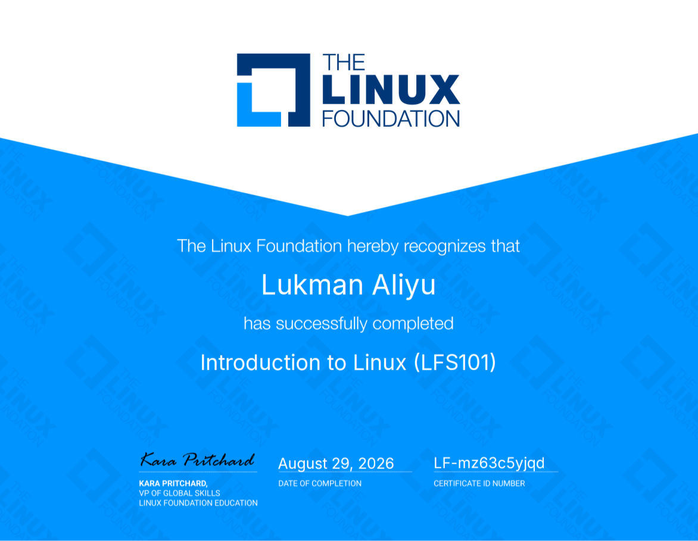

I have completed the Linux Foundation's [Introduction to Linux (LFS101)](https://trainingportal.linuxfoundation.org/courses/introduction-to-linux-lfs101) course and earned the certificate. This was a useful opportunity to strengthen my understanding of Linux through both graphical tools and the command line, while becoming more comfortable with the environment that supports so much of modern software and data work.

The course gave me a practical foundation for working across major Linux distributions. I especially valued the hands-on focus: learning the command line is much more meaningful when each command becomes part of a workflow rather than something to memorize in isolation. It also reminded me that confidence with Linux grows through regular practice and exploration.

I completed the exam with a score of **27/30 (90%)**. I am pleased with the result, but the certificate is also a starting point. I plan to keep using the shell in my projects and continue building the habits needed to work effectively in Linux-based environments.

